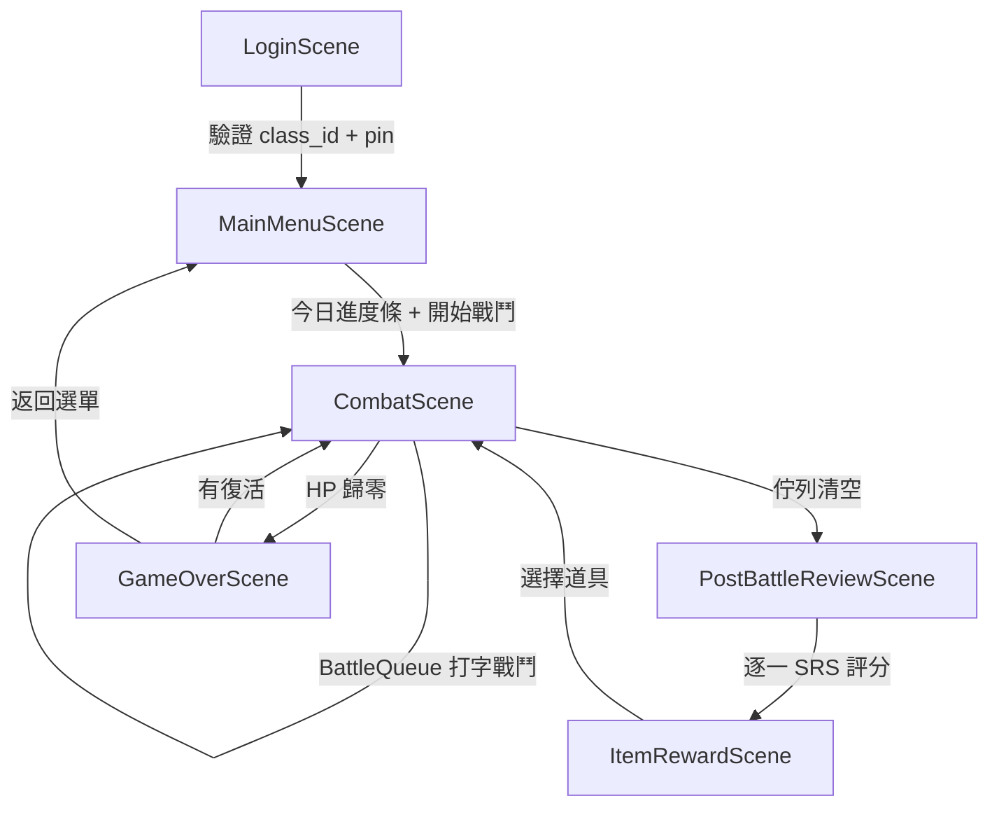

# ⚔️ Typing RPG × SRS 英文學習系統

一款結合 **RPG 戰鬥**、**間隔重複記憶法 (SRS)** 與 **打字練習** 的英文學習遊戲。
玩家透過鍵入英文單字或句子來發動攻擊，系統根據 SM-2 演算法智慧排程複習，讓記憶在最佳時機被強化。

---

## 🎮 核心玩法

### 打字戰鬥

玩家面對怪物時，系統會出示英文單字或句子，玩家必須在時限內正確輸入以發動攻擊。

| 出題類型 | 顯示方式 | 判定方式 | 時限 |
|:---|:---|:---|:---|
| **單字** | 大字顯示目標單字 + 中文定義提示 | 完整正確輸入 | `字元數 × 1.5 秒` |
| **句子** | 逐字元高亮（類 MonkeyType） + 中文翻譯提示 | 正確率 ≥ 80% 算通過 | `字元數 × 1.5 秒` |

> 💡 出題比例依學習階段自動調整：新學 100% 打單字 → 精熟 80% 打句子。

### Combo 與傷害機制

- **Combo 疊加**：連續正確輸入累積 Combo，提升攻擊傷害。
  - `5 Combo`: **Good!**
  - `10 Combo`: **Great!** (+10% 傷害)
  - `15 Combo`: **Excellent!** (+20% 傷害)
  - `20 Combo`: **PERFECT!** (+50% 傷害)
- **句子完美獎勵**：100% 正確率完成句子 → Combo +2。
- **打錯歸零**：未通過的單字/句子，Combo 歸零。

### 道具系統

每通過一關，可從三張道具卡中選一張，獲得戰鬥增益。

| 稀有度 | 出現機率 | 視覺標示 |
|:---|:---:|:---|
| **R** | 60% | 灰色 |
| **SR** | 30% | 藍色 |
| **SSR** | 10% | 橘色 |

### 成就系統

解鎖成就可獲得永久被動加成（攻擊力、血量、爆擊率等）。

### 接關系統

持有復活道具時，HP 歸零可選擇接關繼續戰鬥。

---

## 🧠 SRS 間隔重複系統

基於 **SM-2 演算法**，自動追蹤每個單字的學習狀態，智慧安排複習時機。

### 學習階段

| 階段 | 條件 | 說明 |
|:---|:---|:---|
| `new` | `totalEncounters === 0` | 從未出現 |
| `learning` | 曾出現但未連續答對 | 學習中 |
| `review` | 連續答對 ≥ 1 次 | 複習階段 |
| `mastered` | 連續答對 ≥ 4 次 且 `easeFactor ≥ 2.5` | **精熟** |

### 戰鬥內 Again 重練

打錯的單字/句子**不會消失**，而是插入佇列尾端，強制在同一場戰鬥內再打一次。

```
初始佇列：[w001, w002, w003, w004, w005]

w001 ✅ 正確 → 出隊
w002 ❌ 打錯 → 插入尾端 (againCount=1)
w003 ✅ 正確 → 出隊
w004 ✅ 正確 → 出隊
w005 ✅ 正確 → 出隊
w002 ✅ 重練成功 → 出隊（記錄為「重練成功」）

佇列清空 → 戰鬥結束
```

| 規則 | 說明 |
|:---|:---|
| 插入位置 | 佇列尾端（先喘口氣） |
| 最大重練次數 | **2 次**，超過標記 `again`，排程至下一關 |
| 重練成功的 SRS 影響 | 最高只評為 `Hard`（不是 `Good`） |
| 重練失敗的 SRS 影響 | `Again`，間隔重置為 1 |
| Combo 影響 | 打錯歸零；重練成功恢復到 1 |

### 戰後複習 (PostBattleReview)

每關結束後，逐一顯示本關所有單字，玩家對每個單字評定熟悉度：

| 按鈕 | 效果 |
|:---|:---|
| **Again** | 間隔重置、下一關再出現 |
| **Hard** | 間隔小幅增加、難易係數下降 |
| **Good** | 間隔正常增加 |
| **Easy** | 間隔大幅增加、難易係數上升 |

> 重練成功的單字，`Good` 和 `Easy` 按鈕會被降級處理。

### 每日學習配額

每日自動計算應學習的單字數量，養成持續學習的習慣。

| 參數 | 預設值 | 說明 |
|:---|:---:|:---|
| `newPerDay` | 5 | 每日最多學習新單字 |
| `reviewPerDay` | 10 | 每日最多複習到期單字 |

進度條顯示於主選單與戰鬥 HUD：

```
📅 今日學習進度

🆕 新學  [████████░░] 4/5
🔁 複習  [██████░░░░] 6/10

總進度   [███████░░░] 10/15  67%
```

> 💡 間隔以「關卡數」而非「天數」計算。玩越多關，越多單字到期，自然形成複習壓力。

---

## 📊 資料架構

### Google Sheets 結構

#### Sheet 1：`Vocabulary`

| 欄 | 欄名 | 說明 | 範例 |
|:---:|:---|:---|:---|
| A | `id` | 唯一識別碼 | `word_0001` |
| B | `word` | 英文單字 | `resilient` |
| C | `part_of_speech` | 詞性 | `adj.` |
| D | `definition` | 中文定義 | `有韌性的` |
| E | `example_sentence` | 英文例句 | `She is resilient.` |
| F | `example_translation` | 例句中文翻譯 | `她很有韌性。` |
| G | `collocations` | 搭配詞 | `resilient economy` |
| H | `level` | CEFR 等級 | `B1` |
| I | `tags` | 主題標籤 | `nature,emotion` |
| J | `image_url` | 圖片網址（可選） | `https://...` |
| K | `enabled` | 是否啟用 | `TRUE` |

#### Sheet 2：`Players`

| 欄 | 欄名 | 說明 | 範例 |
|:---:|:---|:---|:---|
| A | `class_id` | 班級座號（主鍵） | `101-01` |
| B | `pin` | 四碼密碼 | `1234` |
| C | `display_name` | 顯示名稱 | `小明` |
| D | `current_level` | 目前遊戲關卡 | `12` |
| E | `total_score` | 累積總分 | `8800` |
| F | `best_score` | 最高分 | `12400` |
| G | `game_mode` | 最近遊玩模式 | `srs` |
| H | `srs_data` | SRS 狀態（JSON） | `{"word_0001":{...}}` |
| I | `last_updated` | 最後更新時間 | `2024-06-01T14:30:00Z` |
| J | `daily_quota` | 今日配額（JSON） | `{"date":"2024-06-01",...}` |

#### `srs_data` JSON 結構（Key 縮寫）

| 縮寫 | 完整名稱 | 說明 |
|:---:|:---|:---|
| `ef` | `easeFactor` | SM-2 難易係數 (1.3 ~ 3.0) |
| `iv` | `interval` | 下次複習間隔（關卡數） |
| `rp` | `repetitions` | 連續答對次數 |
| `nr` | `nextReviewLevel` | 下次應出現的關卡編號 |
| `fm` | `familiarity` | 最新評分 (again/hard/good/easy) |
| `te` | `totalEncounters` | 總出現次數 |
| `cc` | `correctCount` | 總正確次數 |
| `lu` | `lastUpdated` | 最後更新時間 |
| `st` | `stage` | 學習階段 (new/learning/review/mastered) |

> 只儲存 `te > 0`（曾遇過）的單字，減少 JSON 大小。

### 字彙載入策略（混合模式）

```
遊戲啟動
  ├─ localStorage 有快取? → 載入快取
  ├─ 無快取 → 載入內嵌 fallback 字彙
  └─ 背景 fetch Sheet 字彙
       ├─ 成功 → 更新快取 + 使用最新資料
       └─ 失敗 → 繼續使用現有資料（離線可用）
```

---

## 🏗️ 程式架構

### 場景流程



### 核心模組

```
src/
├── systems/           # 學習機制核心（純邏輯，不依賴 PixiJS）
│   ├── SRSEngine      # SM-2 演算法
│   ├── BattleQueue    # 戰鬥佇列 + Again 重練
│   ├── DailyQuota     # 每日配額
│   ├── WordSelector   # 優先級選字
│   └── PromptGenerator # 單字/句子出題引擎
├── scenes/            # PixiJS 場景
├── ui/                # 可複用 UI 元件
├── data/              # 字彙管理
├── items/             # 道具系統
├── utils/             # 雲端存檔、動畫、成就
├── graphics/          # 繪圖（勇者/怪物）
└── state/             # 全域狀態
```

### GAS API

| Action | 說明 |
|:---|:---|
| `GET_VOCAB` | 回傳 Vocabulary Sheet 全部啟用的單字 |
| `LOGIN` | 驗證 class_id + pin，回傳玩家資料 |
| `SAVE_PLAYER` | 儲存進度（含 srs_data + daily_quota） |
| `GET_LEADERBOARD` | 取得排行榜 Top 10 |

---

## 🛠️ 開發環境

| 項目 | 版本 |
|:---|:---|
| Node.js | v18+ |
| 建置工具 | Vite |
| 程式語言 | TypeScript |
| 渲染引擎 | PixiJS v8 |
| 後端 | Google Apps Script |
| 資料庫 | Google Sheets |

### 快速開始

```bash
# 安裝依賴
npm install

# 啟動開發伺服器
npm run dev

# 建置生產版本
npm run build
```

### GAS 部署

1. 在 Google Sheets 中建立 `Vocabulary` 和 `Players` 兩個工作表。
2. 將 `gas/Code.gs` 的內容貼到 **Apps Script 編輯器**。
3. 部署為 **Web App**（存取權限設為「所有人」）。
4. 在遊戲登入畫面貼上 GAS Web App URL。

---

## 📋 開發進度

### Sprint 1：核心系統 ⬜
- [ ] 專案初始化（Vite + TypeScript + PixiJS）
- [ ] 型別定義（`srs.ts`, `game.ts`）
- [ ] SRSEngine（SM-2 + 精熟判定）
- [ ] BattleQueue（Again 重練佇列）
- [ ] DailyQuota（每日配額）
- [ ] WordSelector（優先級選字）
- [ ] PromptGenerator（單字/句子出題比例）

### Sprint 2：後端 + 資料層 ⬜
- [ ] Google Sheets 建立
- [ ] GAS Code.gs（4 支 API）
- [ ] CloudSave.ts（雲端通訊）
- [ ] VocabManager.ts（混合模式）
- [ ] PlayerState.ts（全域狀態）
- [ ] 內嵌 fallback 字彙

### Sprint 3：戰鬥場景 ⬜
- [ ] 場景管理系統
- [ ] LoginScene（登入）
- [ ] TypingDisplay（單字 + 句子雙模式）
- [ ] CombatScene（戰鬥 + BattleQueue 整合）

### Sprint 4：評分 + 選單 ⬜
- [ ] PostBattleReviewScene（SRS 評分）
- [ ] MainMenuScene（今日進度條）
- [ ] ItemRewardScene（道具三選一）
- [ ] GameOverScene（結算 + 接關）
- [ ] AchievementSystem（成就）

### Sprint 5：測試 + 部署 ⬜
- [ ] 全流程整合測試
- [ ] 極端情境測試
- [ ] iPad/行動裝置適配
- [ ] GitHub Pages 部署

---

## 📜 授權

MIT License
